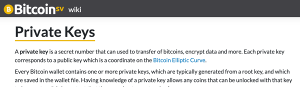

=======================
Getting Started with Smart Contracts on Bitcoin
=======================

Jargon and Basics
-----------------

Know all about how Bitcoin works? Skip to Setting-Up_.

.. _setting-up:

The concepts are rather simple but obscure terms may confuse someone starting out or coming from another procotol.
Here we define the essential jargon:

The Ledger
  - A public record of valid *Transactions*
  
.. image:: _static/images/slack_ledger.png
    :width: 400px
    :align: center
    :alt: CSW on the ledger
    
UTXO
  - Unspent *Transaction* (TX) Output.
  - Located at an *Address*.
  - Can contain Bitcoin *Tokens*.
  - Imagine it as an envelope that can be opened (unlocked) only once.
  - The *UTXO* Model is different to Ethereum's account model, which may confuse developers coming from ETH!
  
.. image::  _static/images/slack_utxo_vs_account_model.png
    :alt: CSW on the UTXO vs Account Model
    :align: center

Transaction
  - Contains a *Smart Contract*
  - Can create multiple *UTXOs*

    
.. image::  _static/images/slack_tokens_envelopes_ledger.png
    :width: 400px
    :alt: CSW on the UTXO vs Account Model
    :align: center
    
Address
  - Unique identifier owned by the recipient party in a *Transaction*.  *Bitcoin Tokens* can be sent to an address.
  - Ideally to be used only once
  - `Read more in the Bitcoin SV Wiki: <https://wiki.bitcoinsv.io/index.php/Bitcoin_address>`_

Wallet
  - Can own multiple *Wallet Addresses*
  - Can own multiple *UTXOs*
  - During a *Transaction* it gathers enough *Bitcoin Tokens* from its *UTXOs* to cover the cost of the *Transaction*
    - eg. A wallet sends 10 bitcoin to another wallet.  Say it owns two UTXOs, one containing 7 bitcoin and another containing 4, these two are unlocked.  The transaction creates two new UTXOs: one containing 10 bitcoin to be received by the other wallet and another containing the change of 1 bitcoin, still to be owned by the sending wallet.
  - Accessible to its owner via its *Private Keys*
  - `Read more in the Bitcoin SV Wiki: <https://wiki.bitcoinsv.io/index.php/Private_Keys>`_

Miner
  - A *Transaction* processor that validates *Transactions*.  
  - If a *Transaction* is valid the *Miner* executes it and adds the *Transaction*'s *UTXOs* to the Bitcoin *Ledger*.

Smart Contract
  - A self executing contract with its terms implemented in code.
  - Executed by *Miners*, if they confirm the *Transaction* is valid.
  - Contained in a *UTXO*.
  - Has a *Locking Script* to seal the envelope(*UTXO*) and an *Unlocking Script* to open it.
  - Written in a Forth-like low level language called *Bitcoin Script*.
  - Can be used for a wide variety of purposes, some simple common examples:
  
    - to send *Bitcoin Tokens* to a specified *Wallet*
    - for a *Miner* to redeem their newly mined *Bitcoin Tokens*
    - to require the approval of multiple individuals to execute a *Transaction*

Locking and Unlocking Scripts
  - The *Locking Script* is a puzzle and the *Unlocking Script* the solution/answer to that puzzle.

P2PKH
  - Stands for Pay to Public Key Hash.
  - The most commonly used type of *Smart Contract*
  - Sends *Bitcoin Tokens* to a single *Address*, identified by the recipient's *Address*' Public Key Hash.

sCrypt
  - A language and IDE for writing *Smart Contracts* for Bitcoin.
  - A high level language, similar to JavaScript, that compiles to *Bitcoin Script*.
  - Its name originated from a combination of 'script' and 'Ncrypt'(previous name of nChain).

Setting Up
----------
work in progress... will add vscode install, testnet setup ready to make the P2PKH 
then step by step through to publishing and testing

.. code-block:: solidity
    
    contract Test {
    }

text ``code()``

